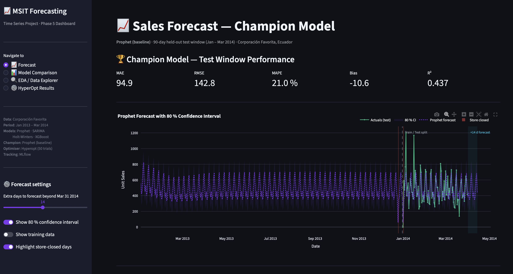
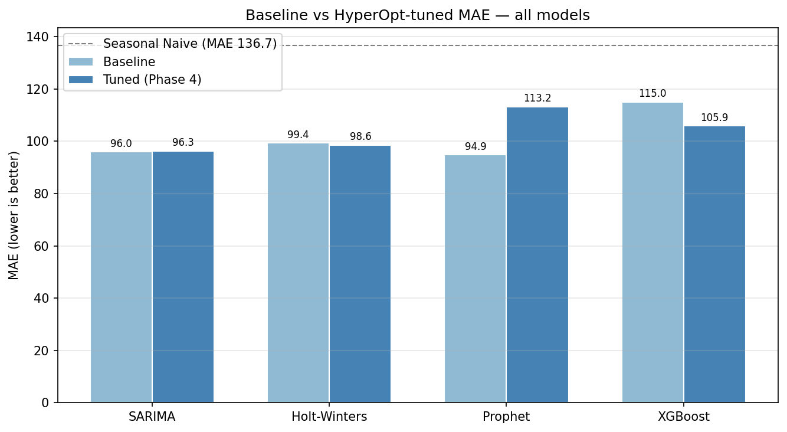
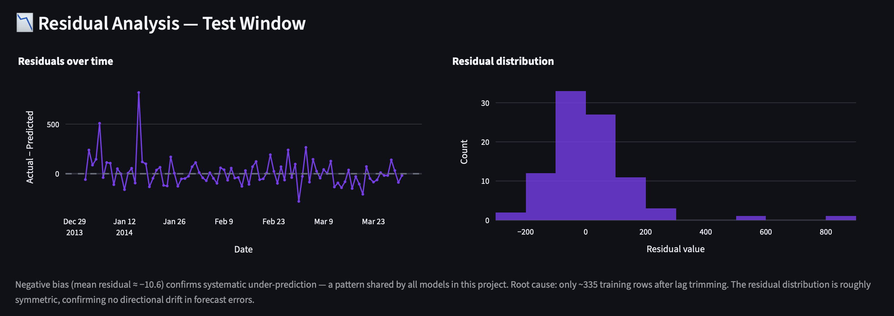

# 📈 Time Series Forecasting — Retail Sales

An end-to-end time series forecasting case study built on daily unit-sales data from the Corporación Favorita grocery chain in Ecuador. The project covers the full ML workflow: exploratory analysis → statistical & ML model training → hyperparameter optimisation → experiment tracking → interactive Streamlit dashboard.



---

## 🚀 Quick Start

```bash
# 1. Clone the repo
git clone https://github.com/pawel-gebicki/timeseries.git
cd timeseries

# 2. Create and activate the virtual environment
python3 -m venv .venv
source .venv/bin/activate          # Windows: .venv\Scripts\activate

# 3. Install dependencies
pip install -r requirements.txt

# 4. Launch the Streamlit dashboard
streamlit run app.py
```

Then open **http://localhost:8501** in your browser.

> **VS Code shortcut:** Press `Cmd+Shift+B` (Mac) or `Ctrl+Shift+B` (Windows/Linux) to launch the dashboard directly from the editor — no terminal typing needed. A `tasks.json` is included in `.vscode/` that wires this up automatically.

---

## 📊 Live Dashboard — 4 Pages

| Page | What you see |
|---|---|
| 📈 **Forecast** | Prophet champion model predictions with 80 % confidence interval, residual analysis, up to +30 day horizon |
| 📊 **Model Comparison** | All 5 models ranked by R², MAE, RMSE, MAPE — pulled live from MLflow |
| 🔍 **EDA / Data Explorer** | Full Phase 1 story: seasonality, oil-price overlay, distributions, raw data table |
| ⚙️ **HyperOpt Results** | Baseline vs tuned delta table, grouped bar charts, best hyperparameters for all 4 models |

---

## 🗂️ Project Structure

```
timeseries/
│
├── app.py                          # Streamlit dashboard (Phase 5)
├── requirements.txt                # Pinned dependencies
│
├── notebooks/
│   ├── 01_eda.ipynb                         # Phase 1 — EDA & data cleaning
│   ├── 02_statistical_models.ipynb          # Phase 2 — SARIMA, Holt-Winters, Prophet
│   ├── 03_feature_engineering_and_ml_models.ipynb  # Phase 3 — XGBoost baseline
│   ├── 04_hyperparameter_tuning_and_mlflow.ipynb   # Phase 4 — HyperOpt + MLflow
│   └── 05_app_prototype.ipynb               # Phase 5 — forecast logic prototype & chart tests
│
├── src/
│   ├── data_loader.py              # Loads raw CSVs
│   ├── feature_engineering.py      # Lag, rolling, oil-lag feature builders
│   └── evaluation.py               # Shared evaluate_model() used by all phases
│
├── data/
│   ├── timeseries.csv              # Raw daily sales data
│   ├── oil.csv                     # WTI crude oil prices
│   ├── holidays.csv                # Ecuador national holidays
│   ├── stores.csv                  # Store metadata
│   └── timeseries_features.csv     # Phase 1 output — cleaned + feature-engineered
│
├── models/
│   ├── best_model.pkl              # Serialised champion Prophet model
│   ├── best_model_name.txt         # Champion label
│   └── phase4_best_params.json     # Best hyperparameters for all 4 models
│                                   #   (committed — the app needs these on a fresh clone)
│
├── images/                         # All figures: fig_01–07 EDA (Phase 1), phase2a_* statistical
│                                   #   (Phase 2), phase3_* ML (Phase 3), fig_08–11 tuning
│                                   #   (Phase 4), plus dashboard.png and residuals.png
│
├── mlruns/                         # MLflow experiment tracking store (not committed)
│
├── .streamlit/
│   └── config.toml                 # Dark theme configuration
│
└── .vscode/
    └── tasks.json                  # Cmd/Ctrl+Shift+B → streamlit run app.py
```

---

## 🔬 Methodology

### Data

Daily unit-sales for one product line, Jan 2013 – Mar 2014 (454 observations). Train / test split: train ≤ 2013-12-31, test 2014 Q1 (90 days). Key EDA findings:

- **Weekly seasonality (s = 7):** Saturday +33 %, Sunday +45 % vs weekday average
- **Stationary series:** ADF test p < 0.05 — no differencing required
- **Store-closed days:** Dec 25 2013 and Jan 1 2014 were missing from the raw data — both rows were added to restore the full calendar, imputed with `unit_sales = 0`, and flagged with `store_open = 0` and `is_national_holiday = 1`

### Feature engineering (Phase 3)

20 features built in `src/feature_engineering.py`:

| Group | Features |
|---|---|
| Lags | lag_1, lag_7, lag_14, lag_30 |
| Rolling | roll_mean / roll_std for windows 7, 14, 28 |
| Calendar | dow, month, week, is_weekend |
| Exogenous | dcoilwtico, is_national_holiday, store_open, oil_lag_1, oil_lag_7 |

### Hyperparameter optimisation (Phase 4)

HyperOpt (Tree-structured Parzen Estimator) was run for **50 trials per model** across all four models — ensuring a fair comparison where no model benefits from extra tuning attention.

---

## 📋 Results

All models evaluated on the same 90-day held-out test window (Jan – Mar 2014):

| Model | MAE | RMSE | MAPE (%) | R² |
|---|---|---|---|---|
| **Prophet (baseline) 🏆** | **94.9** | **142.8** | **21.0** | **0.437** |
| SARIMA (1,0,1)(1,0,1,7) | 96.0 | 143.3 | 21.8 | 0.434 |
| Holt-Winters (tuned) | 98.6 | 150.2 | 20.9 | 0.377 |
| XGBoost (tuned) | 105.9 | 154.7 | 22.5 | 0.339 |
| Seasonal Naive | 136.7 | 219.5 | 32.0 | −0.33 |

**Key finding:** Prophet's baseline outperformed its HyperOpt-tuned variant. XGBoost underperformed all statistical models — a textbook data-starvation effect with only ~335 training rows after lag trimming. **Model simplicity wins when data is scarce.**



Every model beat the seasonal-naive benchmark of MAE 136.7, so the modelling effort
was worth making. But tuning did not reliably help. Prophet got **worse** under
HyperOpt — 94.9 → 113.2 — while XGBoost improved from 115.0 to 105.9 and still lost
to every statistical model. Giving each model an identical 50-trial budget is what
makes that visible: had only XGBoost been tuned, it would have looked competitive.

### Residual analysis



**All models under-predict systematically.** Mean residual on the test window is
≈ −10.6, and the same negative bias appears across every model in the project rather
than in one of them. The residual distribution is roughly symmetric, so there is no
directional drift over the test period — just a consistent downward offset. The cause
is the same one behind XGBoost's poor showing: roughly 335 usable training rows after
lag trimming is simply not much history to learn a level from.

Practically, that means these forecasts should be treated as a slight floor rather
than a centre estimate, and the first improvement worth making is more history — not
a more complex model.

---

## ⚠️ Limitations

- **Single product line, single chain.** Findings describe this series and should not be generalised to the wider Favorita dataset without re-running the comparison.
- **454 observations** is a short history for daily data with weekly seasonality; every result here carries that caveat, and it is the direct cause of both the negative bias and XGBoost's underperformance.
- **No live retraining.** The dashboard serves a model serialised at Phase 4; it does not refit on new data.

---

## 🛠️ Tech Stack

| Layer | Tools |
|---|---|
| Language | Python 3.14 |
| Data | pandas 2.3, numpy 2.4, scipy 1.17 |
| Visualisation | matplotlib, seaborn, plotly 6.7 |
| Statistical models | statsmodels 0.14 (SARIMA, Holt-Winters), prophet 1.3 |
| ML | scikit-learn 1.8, xgboost 3.2 |
| Optimisation | hyperopt 0.2.7 |
| Experiment tracking | mlflow 3.11 |
| Dashboard | streamlit 1.57 |
| Notebooks | jupyterlab 4.5 |

---

## 👤 Author

**Pawel Gebicki** — Business Data Analyst · Power BI, SQL, Python · ten years in logistics and supply chain

[GitHub](https://github.com/pawel-gebicki) · [LinkedIn](https://linkedin.com/in/pawel-gebicki) · [Tableau Public](https://public.tableau.com/app/profile/pawel.gebicki)
